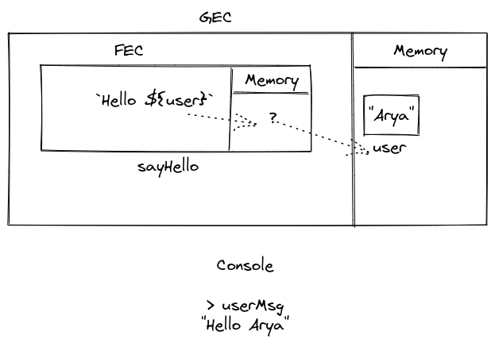

1. What does thread of execution means in JavaScript?
Thread of execution is the steps a program takes to get executed i.e the procedure in which a program gets executed.

2. Where the JavaScript code gets executed?
The JS code gets executed in the Global Execution Context (GEC).

3. What does context means in Global Execution Context?
Context is the place where you execute your code.

4. When do you create a global execution context.
As soon as you write some code JS creates a Global Execution context. A single GEC for a program.

5. Execution context consists of what all things?
Global Execution Context consists of A memory space and the execution part.

6. What are the different types of execution context?
There are two types -
a. Global Execution Context
b. Function Execution Context

7. When global and function execution context gets created?
GEC gets created when a program is executed. Only once per program when JS engine runs your code.
FEC gets executed when a function is created.

8. Function execution gets created during function execution or while declaring a function.
FEX gets created while executing your function.
eg during:
```js
let five = add(2,3) 
```

9. Create a execution context diagram of the following code on your notebook. Take a screenshot/photo and store it in the folder named `img`. Use `` to display it here.


```js
var user = "Arya";

function sayHello(){
  return `Hello ${user}`;
}

var userMsg = sayHello(user);
```

<!-- Put your image here -->




```js
var marks = 400;
var total = 500;

function getPercentage(amount, totalAmount){
  return (amount * 100) / totalAmount;
}

var percentageMarks = getPercentage(marks, total);
var percentageProfit = getPercentage(400, 200);
```

<!-- Put your image here -->


```js
var age = 21;

function customeMessage(userAge){
  if(userAge > 18){
    return `You are an adult`;
  }else {
    return `You are a kid`;
  }
}

var whoAmI = customeMessage(age);
var whoAmIAgain = customeMessage(12);
```

<!-- Put your image here -->

