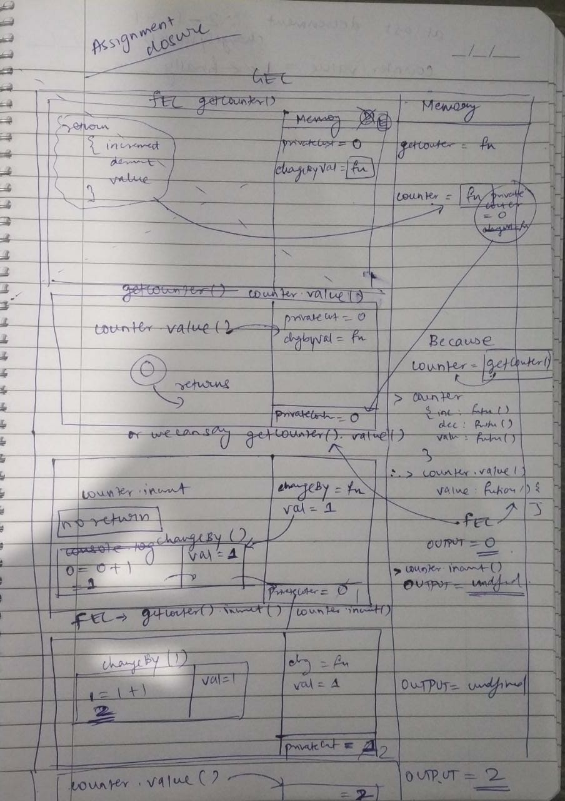
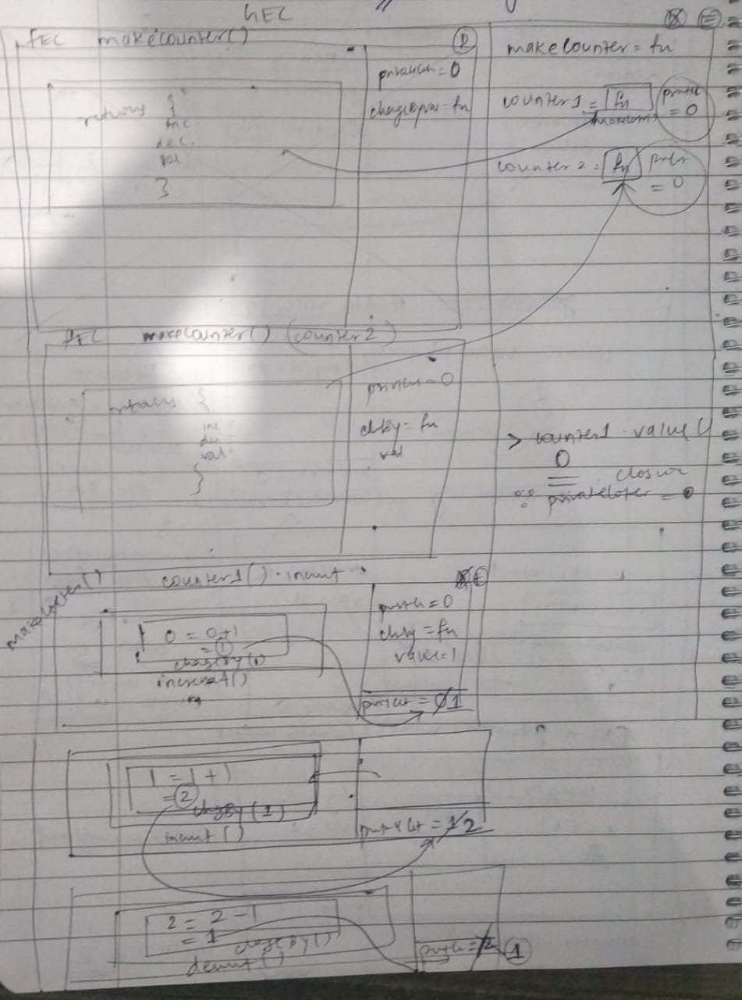

Create the execution context diagram for following code. What will be the output in each line of code

```js
function getCounter() {
  let privateCounter = 0;
  function changeBy(val) {
    privateCounter += val;
  }
  return {
    increment: function () {
      changeBy(1);
    },
    decrement: function () {
      changeBy(-1);
    },
    value: function () {
      return privateCounter;
    },
  };
};

let counter = getCounter()

counter.value();  // 0
counter.increment(); // undefined
counter.increment(); // undefined
counter.value(); // 2
counter.decrement(); // undefined
counter.value(); // 1
```


2. Create the execution context diagram and write the output.

```js
function makeCounter() {
  let privateCounter = 0;
  function changeBy(val) {
    privateCounter += val;
  }
  return {
    increment: function() {
      changeBy(1);
    },

    decrement: function() {
      changeBy(-1);
    },

    value: function() {
      return privateCounter;
    }
  }
};

let counter1 = makeCounter();
let counter2 = makeCounter();

console.log(counter1.value());  // 0

counter1.increment(); // has become 1
counter1.increment(); // has become 2
console.log(counter1.value()); // 2

counter1.decrement(); // has become 1
console.log(counter1.value()); // 1
console.log(counter2.value()); // 0 since it has not changed since the beginning. The same closure value will be shown which was left over after counter2's makeCounter was called. i.e its privateCounter = 0; 
```
